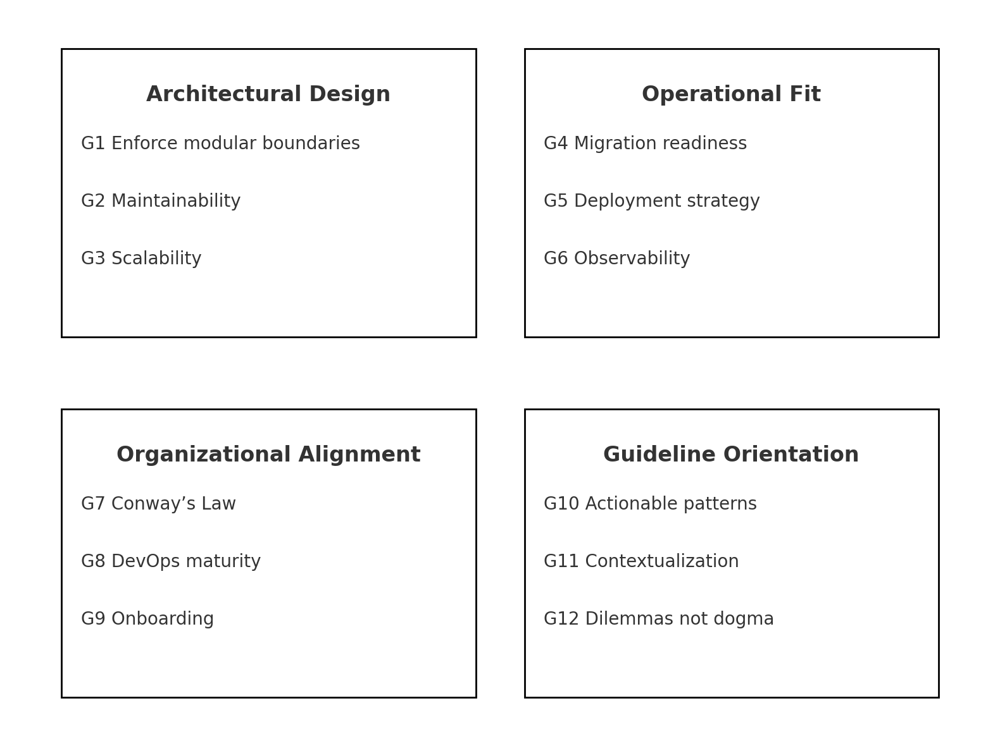
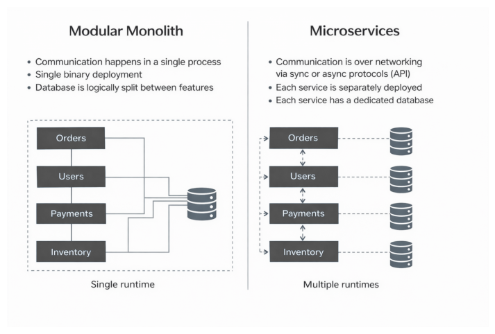
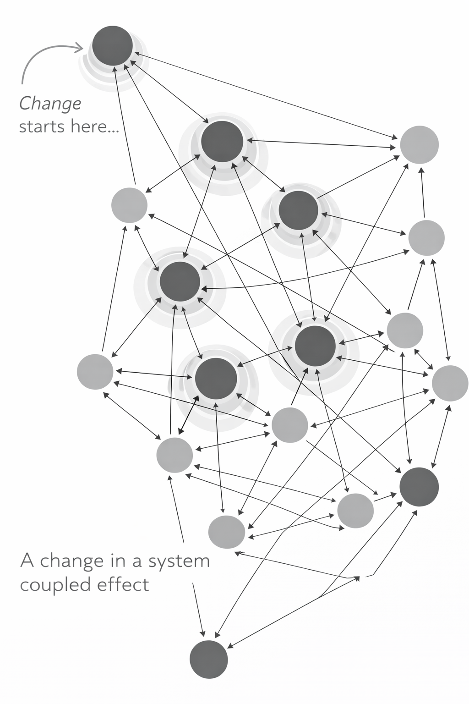
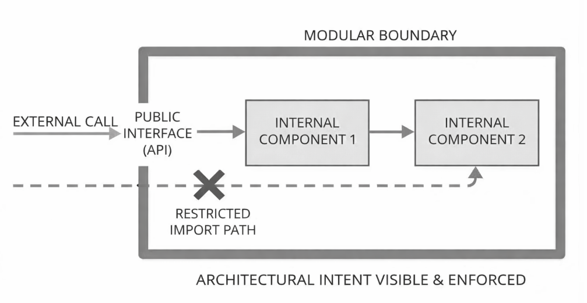
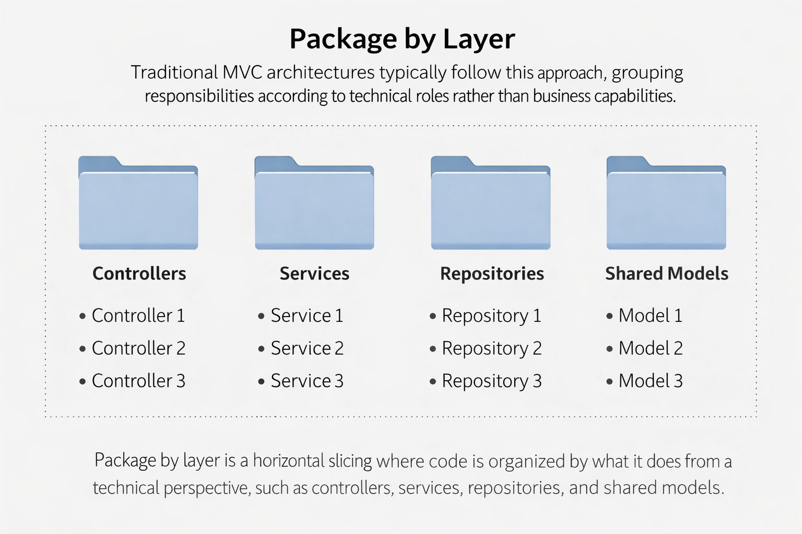
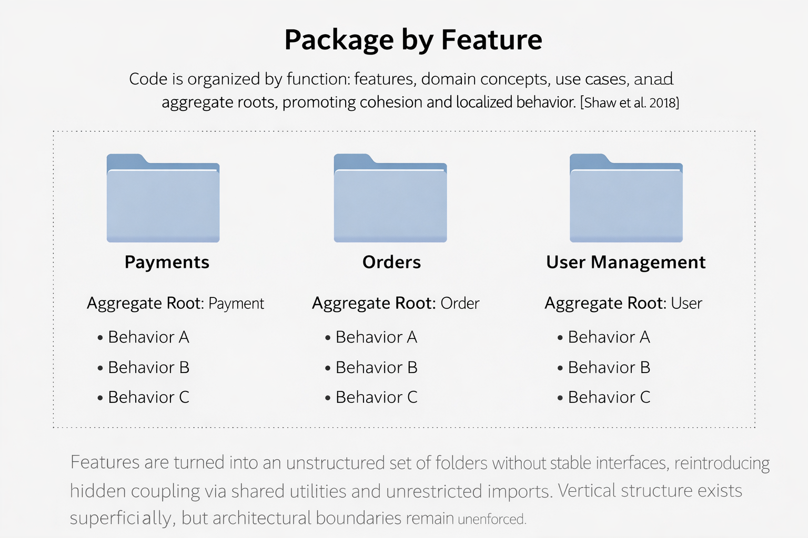
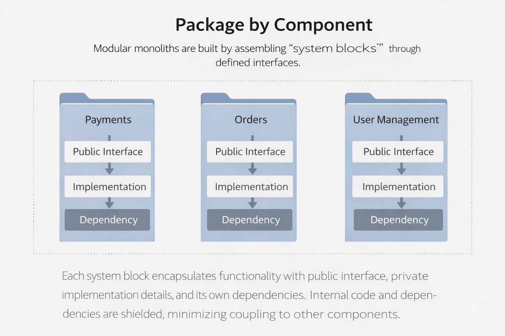
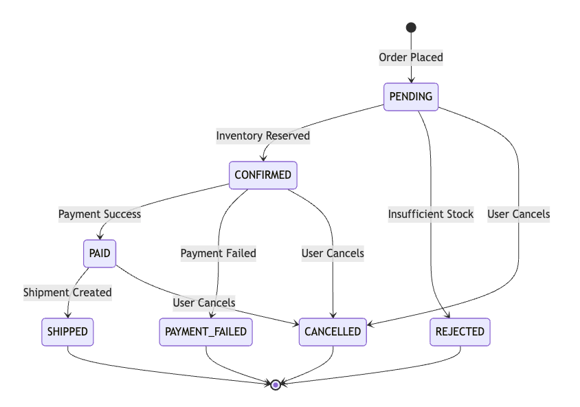
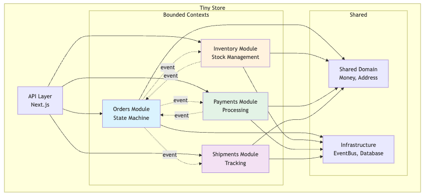

[]{#sec:proposal label="sec:proposal"}

This chapter presents the core academic potential contribution of this research: a set of architectural guidelines designed to support software startups in adopting modular monolithic architectures that preserve scalability, maintainability, and internal modularity. These guidelines are grounded in the gaps and trade-offs identified through the systematic literature review and reflect the specific architectural tensions faced by early-stage software teams operating under conditions of limited resources, rapid iteration, and evolving requirements. Rather than offering a static framework, the guidelines aim to function as decision-making heuristics, designed to be actionable principles that inform architectural evolution without prescribing a single and rigid path.

The original research design identifies twelve guidelines organized across four analytical dimensions introduced in Chapter [\[sec:relatedwork\]](#sec:relatedwork){reference-type="ref" reference="sec:relatedwork"}: Architectural Design, Operational Fit, Organizational Alignment, and Guideline Orientation. This dissertation fully develops the first six guidelines, G1 through G6, covering the Architectural Design and Operational Fit dimensions. These six guidelines form a complete, self-contained guideline set that addresses module boundaries, maintainability, progressive scalability, migration readiness, deployment strategy, and observability. The remaining six guidelines (G7--G12), spanning the Organizational Alignment and Guideline Orientation dimensions, are identified and scoped but deferred to future research (Section [10](#sec:future-guidelines){reference-type="ref" reference="sec:future-guidelines"}).

<figure id="fig:guideline-dimensions" data-latex-placement="htb">

<figcaption>Four guideline dimensions for evaluating modular monolith architectures</figcaption>
</figure>

Figure [1](#fig:guideline-dimensions){reference-type="ref" reference="fig:guideline-dimensions"} shows the four guideline dimensions used in this research to guide the evaluation of modular monolith architectures in startup environments:

- **Architectural Design.** Covers criteria related to the software's internal structure. Guideline G1 enforces clear module boundaries, G2 evaluates maintainability over time, and G3 assesses the system's scalability potential.

- **Operational Fit.** Addresses the operational requirements needed to support production environments. Guideline G4 checks migration readiness (for example, transitioning toward microservices), G5 focuses on deployment strategy and automation, and G6 considers observability levels (logging, metrics, monitoring).

- **Organizational Alignment.** Focuses on aligning the software architecture with the organization's structure. Guideline G7 examines team organization according to Conway's Law, G8 evaluates DevOps maturity, and G9 assesses how easily new team members can be onboarded without technical friction. These guidelines are identified and scoped in this dissertation but deferred to future research (Section [10](#sec:future-guidelines){reference-type="ref" reference="sec:future-guidelines"}).

- **Guideline Orientation.** Refers to high-level recommendations that steer design decisions without imposing rigid rules. Guideline G10 emphasizes practical, actionable patterns, G11 highlights the need to adapt recommendations to the specific business context, and G12 points out that trade-offs and dilemmas exist rather than unbreakable dogma. These guidelines are identified and scoped in this dissertation but deferred to future research (Section [10](#sec:future-guidelines){reference-type="ref" reference="sec:future-guidelines"}).

Each dimension group provides a set of guidelines that, together, form the foundation for the proposal of this research. It illustrates how technical, operational, organizational, and orientation-based considerations should be integrated when selecting or evolving a modular monolith architecture in software startups. What follows is a descriptive presentation of the guidelines within each dimension and their foundation concepts, starting with those that address the architectural design of modular monoliths.

# Reference Implementation and Technology Stack {#sec:tech-stack}

The guidelines proposed in this chapter are grounded in a reference implementation called **Tiny Store**[^1], an Nx monorepo e-commerce application with four domain modules: orders, inventory, payments, and shipments. All code examples, exercises, and verification scenarios reference this implementation. Table [1](#tab:tech-stack){reference-type="ref" reference="tab:tech-stack"} summarizes the production-grade technology stack used across the guidelines.

::: {#tab:tech-stack}
  --------------------------------------------------------------------------------------------------------
  **Tool**                                  **Purpose**                                           **GL**
  ----------------------------------------- ----------------------------------------------------- --------
  Nx                                        Monorepo management, dependency graph, affected CI    G1, G5

  ESLint + \@nx/enforce-module-boundaries   Boundary enforcement at lint time                     G1

  KafkaJS + Apache Kafka                    Event-driven communication, topic-per-aggregate       G4

  Temporal                                  Durable workflows, saga orchestration, compensation   G4

  Redis + ioredis                           Caching layer (L1 vertical optimization)              G3

  BullMQ                                    Async job queues (L2 async decoupling)                G3

  TypeORM + PostgreSQL                      ORM with per-module schema isolation                  G3

  OpenTelemetry                             Distributed traces, metrics, structured logging       G6

  Jaeger                                    Trace visualization and analysis                      G6

  Prometheus + Grafana                      Metrics collection, dashboards, alerting              G6

  Docker + Docker Compose                   Local development, D0 baseline deployment             G5

  Kamal                                     Production deployment, zero-downtime, SSL             G5

  GitHub Actions                            Module-aware CI with Nx affected                      G5
  --------------------------------------------------------------------------------------------------------

  : Technology stack used in the Tiny Store reference implementation
:::

The deliberate choice of production-grade tooling from day one is central to the thesis argument: by embedding infrastructure such as Kafka, Temporal, and OpenTelemetry inside the monolith before any extraction occurs, the system is operationally ready for distribution while retaining the simplicity of a single deployable unit. These tools are not migration prerequisites to be added later; they are architectural requirements that make progressive scalability achievable.

# Background for Architectural Design Dimension {#sec:background-architectural-design}

Modern software architecture treats modularity as a primary mechanism for balancing immediate development needs with long-term scalability. In the context of a modular monolith, this means structuring the application as a single deployable unit that internally consists of well-defined, self-contained modules. Each module acts as a building block of the system, encapsulating a cohesive set of related functionality behind a clear boundary. By imposing strict internal module boundaries and interfaces, a modular software design approach can preserve many benefits commonly associated with more distributed architectures, such as parallel development by multiple engineering teams, maintainability, and scalability, while avoiding a substantial portion of the operational complexity of distributed systems [@abgaz2023decomposition; @grzybek2020modular]. In essence, the monolith's internals are made scalable and maintainable by design, and the system remains ready for gradual growth or future distribution, enabling progressive scalability [@grzybek2020modular]. In summary, modular monolith architecture aims to achieve scalability and maintainability through disciplined modular boundaries within a single deployable unit.

<figure id="fig:modular-deployment-units" data-latex-placement="H">

<figcaption>Deployment units in modular monoliths and microservices. The left side illustrates a modular monolith, where domain-aligned modules (e.g., Orders, Users, Payments, Inventory) execute within a single runtime and may share a single data store, while enforcing internal boundaries through code-level constraints. The right side illustrates microservices, where each service runs as an independent runtime and typically owns its persistence, enabling independent deployment and scaling at the cost of distributed-system operational overhead. Source: Dr Milan Milanović (adapted for this research).</figcaption>
</figure>

Against this background, the discussion that follows places emphasis on the Architectural Design dimension. This research proposes that progressive scalability in modular monoliths depends first on enforceable modularity, meaning clear boundaries, explicit contracts, and build or test-time checks that detect boundary corruption early.

This priority also shapes the guideline order. The guidelines are presented by impact, with G1 as the foundation: without verifiable boundary enforcement, later guidelines are harder to apply because they assume stable module interfaces and controlled coupling. For that reason, this section introduces the concepts needed for the Architectural Design guidelines, including modular decomposition styles, coupling and cohesion, screaming architecture, layering, packaging strategies, and module design principles. The goal is to make explicit how coupling patterns affect the cost of change, and why domain-centric modularity helps sustain cohesion over time.

A useful way to frame architectural design is as an evolutionary progression in separation of concerns. Early architectural organization frequently optimized for technical separation, for example MVC and layered structures. Over time, the emphasis shifted toward dependency discipline and domain centric organization, as seen in Hexagonal Architecture, Onion Architecture, and Clean Architecture [@cockburn2005hexagonal; @palermo2008onion; @martin2012clean].

<figure id="fig:layered-vs-domain-architecture" data-latex-placement="H">

<figcaption>Layered versus domain-centric architecture. This representation supports the argument that domain-centric shifts the primary decomposition axis from technical layers to business capabilities, with the goal of improving cohesion and reducing cross-cutting coupling.</figcaption>
</figure>

In parallel, packaging strategies evolved from technical layers to feature slices, and then to component-like modules that align more directly with domain boundaries [@shaw2018vertical]. This research proposal positions modular monolith guidelines as a pragmatic state of practice that combines these influences, aiming to control change cost by constraining coupling and making boundaries verifiable in code.

## Cost of Change: Coupling and Cohesion {#cost-of-change-coupling-and-cohesion .unnumbered}

Cost of change is often dominated by dependency structure rather than by local code complexity. As Russell L. Ackoff argues, *"A system is never the sum of its parts, it's the product of their interactions."* This perspective motivates treating coupling patterns as first order architectural concerns, because interactions are where change propagates, coordination increases, and unintended side effects emerge.

When introducing coupling and cohesion, this research proposal explicitly draws on the structured design foundations of Edward Yourdon and Larry Constantine, whose work provides a rigorous vocabulary for understanding how dependency structure shapes maintainability and change amplification [@yourdon1979structured]. Their framing is used here to examine three claims that are central to the Architectural Design Dimension (G1--G3):

- **Not all coupling is born equal.** Some dependencies are stabilizing and intentional, particularly inside a coherent boundary, while others are accidental and create ripple effects across unrelated areas.

- **Decoupling has its cost.** Indirection, abstractions, and additional interfaces can reduce harmful dependency, but may increase cognitive load and implementation overhead if applied without need.

- **Cohesion is coupling in the right places.** Coupling is not eliminated, it is relocated into cohesive units so that change remains localized.

These claims motivate a baseline definition of what *"good modularity"* is aimed at in this research. Software design can be treated as the act of modeling units of **strong cohesion, loosely coupled** to each other. The Architectural Design Dimension (G1--G3) operationalizes this by proposing guidelines that make coupling explicit, constrain it through boundary rules, and preserve cohesion by aligning modules with business capabilities rather than technical utilities.

This framing also clarifies why domain centric modularity is emphasized. Functional decomposition is generally preferred over technical decomposition when the goal is to reduce change amplification, because it tends to localize business evolution inside a bounded unit. This directly relates to the distinction between intrinsic complexity, which comes from the domain and requirements, and accidental complexity, which comes from architectural and organizational choices. A recurring risk in modularization is mistaking organization for encapsulation, because directory structure alone does not enforce boundaries unless it is backed by interface contracts and dependency rules.

## Modular Decomposition Styles: Horizontal vs Vertical {#modular-decomposition-styles-horizontal-vs-vertical .unnumbered}

A fundamental design decision concerns how system functionality is decomposed. The two primary strategies are horizontal decomposition, organized by technical layer, and vertical decomposition, organized by feature or business capability. In traditional layered architectures, code is structured by technical responsibilities such as presentation, application services, and persistence. While this approach provides a form of separation of concerns, it often disperses domain logic across multiple layers and obscures the system's business intent [@fowler2002patterns]. As a result, understanding or modifying a specific feature frequently requires coordinated changes across several layers.

This change amplification effect can be stated directly. Changes to a layered architecture usually result in changes across all layers. The reason is that the dependency structure encourages features to cut across horizontal boundaries, even when the business change is conceptually localized. This coupling pattern increases the long term cost of change, because each new behavior requires cross layer coordination, additional integration effort, and broader regression risk.

<figure id="fig:change-coupling-ripple" data-latex-placement="H">

<figcaption>Coupled-change ripple in a dependency graph. Nodes represent components and directed edges represent dependencies. The change originates at the top node (annotated as the starting point) and propagates along dependency paths. Darker nodes indicate components impacted by the initial modification, while lighter nodes remain unaffected. Concentric halos emphasize the spread of change through the system, illustrating how tighter coupling amplifies change impact beyond the original change.</figcaption>
</figure>

Vertical decomposition addresses this limitation by organizing code around features, use cases, or domain capabilities. All elements required to implement a specific behavior, including API endpoints, business logic, and data access, are grouped within a single module or slice. This approach is commonly referred to as package by feature or vertical slice architecture [@shaw2018vertical]. By aligning structural boundaries with business concepts, vertical decomposition tends to increase cohesion, reduce cross feature coupling, and make related code easier to find, because feature behavior is not scattered across horizontal layers.

<figure id="fig:layered-vs-modular" data-latex-placement="H">

<figcaption>Layered and modular architecture. The left side shows a traditional layered decomposition, where code is organized by technical responsibility (presentation, business logic, and data access). The right side shows a modular decomposition, where domain modules (for example, User, Order, and Inventory) each contain their own UI/API, application logic, and persistence concerns, keeping feature changes more localized within module boundaries.</figcaption>
</figure>

A key risk at this stage is architectural *\"cargo culting\"*, where teams adopt a packaging style or pattern without understanding the coupling problem it is intended to solve. It can also refer to the results of applying a design pattern or coding style blindly without understanding the reasons behind that design principle. In practice, this risk is elevated when architecture is documented as diagrams but not enforced in code, because teams can claim domain boundaries while the implementation continues to couple through shared models, utilities, or unrestricted imports.

## Screaming Architecture: Domain Alignment and Model--Code Gap {#screaming-architecture-domain-alignment-and-modelcode-gap .unnumbered}

A *screaming architecture* is one in which the system's structure communicates its business purpose at a glance. A well-designed codebase foregrounds domain concepts and use cases in its top-level organization, rather than privileging frameworks, infrastructure, or technical layering [@martin2012clean; @martin2011screaming]. Under this view, architecture is expressed less by diagrams and more by what the source code organization makes immediately visible, what the codebase "*screams*" becomes a proxy for architectural intent.

This perspective is particularly relevant to the Architectural Design Dimension (G1--G3), where modular boundaries are treated as first-class architectural elements. When the dominant structural signals emphasize technical concerns instead of domain concepts, the system tends to drift away from domain-centric modularity. Over time, this drift increases the cost of change, since engineers must reconstruct domain intent from dispersed artifacts, raising cognitive load and coordination overhead.

This risk connects to the *model--code gap* [@fairbanks2010justenough], the divergence between an architecture as documented and an architecture as implemented. Fairbanks argues that when architectural decisions are not made evident in code, they erode under delivery pressure, producing systems that appear compliant in documentation while contradicting the intended structure in practice.

To reduce this gap, Fairbanks proposes an *architecturally-evident coding style*, where architectural decisions are encoded directly into module boundaries and enforced dependency rules [@fairbanks2010justenough]. Mechanisms include explicit public interfaces, restricted import paths, and structural checks that fail when dependency constraints are violated. A central implication for this research is that modular boundaries should be explicit, inspectable, and continuously enforced by the codebase, making violations difficult to introduce unintentionally.

<figure id="fig:explicit-modular-boundary" data-latex-placement="H">

<figcaption>Explicit modular boundary with enforced imports.</figcaption>
</figure>

An example of what a screaming architecture looks like in practice is illustrated by the high-level directory structure that will be explored in detail in the guideline examples. Even without inspecting individual files or previous knowledge of the codebase, the system's domain and capabilities are immediately apparent:

    ├── /modules/                  # Bounded contexts represented in Modules
    │   ├── orders/
    │   │   ├── domain/
    │   │   │   ├── entities/          # Order aggregate
    │   │   │   ├── value-objects/     # OrderItem, CustomerId
    │   │   │   ├── events/            # Domain events
    │   │   │   └── repositories/      # OrderRepository (database operations)
    │   │   ├── features/             # Use cases (vertical slices)
    │   │   │   ├── place-order/           # Place Order services/use-cases
    │   │   │   └── cancel-order/          # Cancel Order services/use-cases  
    │   │   └── listeners/             # Event handlers of Orders
    │   ├── inventory/                # Inventory module
    │   ├── payments/                 # Payments module
    │   └── shipments/                # Shipments module

At this level, the architecture already "*screams*" business capabilities such as orders, inventory, payments, and shipments, rather than technical layers or framework concerns. This structure makes domain boundaries, use cases, and integration points visible by construction, reducing the model--code gap before any implementation details are examined.

Within this research, screaming architecture and the model--code gap are treated as two facets of the same underlying problem. Architecture that exists only in documentation is fragile and prone to corruption. Architecture that is embedded in module boundaries, public APIs, and enforced dependency direction becomes continuously verifiable. This embedded nature is a prerequisite for controlling coupling, sustaining cohesion, and supporting progressive scalability within a modular monolith, and directly informs the Architectural Design Dimension (G1--G3) introduced in the following sections.

## Separation of Concerns and Dependency Discipline {#separation-of-concerns-and-dependency-discipline .unnumbered}

Separation of concerns can be implemented through architectural styles that constrain dependency direction. Layered Architecture typically structures dependencies outward to inward by technical responsibility, often represented as Presentation, Business, and Persistence layers [@fowler2002patterns]. While layering can improve local reasoning, it may also amplify change cost when features cut across layers and when domain logic is fragmented into anemic models and service orchestration.

Hexagonal Architecture, Onion Architecture, and Clean Architecture formalize a stricter dependency rule: business logic is insulated from delivery and infrastructure concerns, and dependencies must point inward toward stable domain abstractions [@cockburn2005hexagonal; @palermo2008onion; @martin2012clean]. A common representation of this structure is:

<figure id="fig:layered-vs-hexagonal-vs-modular" data-latex-placement="H">

<figcaption>Comparison of architectural decomposition styles.</figcaption>
</figure>

The intent is to reduce coupling to volatile infrastructure by inverting dependencies through interfaces and ports. This can reduce change cost because infrastructure replacements, testing strategies, and delivery mechanisms can evolve without rewriting core domain logic. However, dependency discipline alone does not guarantee domain centric modularity. A codebase can follow inward dependencies and still be organized as a single, tightly coupled domain blob if boundaries between business capabilities are not explicit.

## Packaging and Slicing Strategy {#packaging-and-slicing-strategy .unnumbered}

Packaging strategy determines what coupling is easy and what coupling is discouraged. This section compares three strategies using consistent terminology, because the Architectural Design Dimension (G1--G3) depends on understanding what each strategy optimizes for and where it tends to fail.

Package by layer is a horizontal slicing where code is organized by what it does from a technical perspective, such as controllers, services, repositories, and shared models. Traditional MVC architectures typically follow this approach, grouping responsibilities according to technical roles rather than business capabilities.

The primary failure mode is that business changes often span multiple technical packages, increasing coordination and regression risk. In layered architectures, even localized changes typically propagate across presentation, application, and persistence layers, amplifying the cost of change. This approach is closely associated with the model--code gap, since domain boundaries may be articulated in documentation while the code structure instead emphasizes technical layers.

This failure mode is reinforced by delivery-driven optimization, where short-term convenience encourages cross-layer shortcuts and shared abstractions. As business behavior evolves, conceptually narrow changes tend to trigger multi-layer modifications, increasing change amplification and obscuring architectural intent. Because domain boundaries remain implicit and unenforced in the code, the system gradually reflects technical decomposition rather than business capability, widening the model--code gap and weakening the sustainability of modular reasoning.

<figure data-latex-placement="H">

</figure>

Package by feature is a vertical slicing where code is organized by what it does from a functional perspective, including features, domain concepts, use cases, and aggregate roots. Cited benefits include higher cohesion, lower coupling, and related code being easier to find, because the implementation of a behavior is localized rather than scattered across technical packages [@shaw2018vertical].

A common failure mode is turning features into an unstructured set of folders without stable interfaces, which can reintroduce hidden coupling through shared utilities and unrestricted imports. In such cases, vertical structure exists superficially, but architectural boundaries remain unenforced.

Another side-effect failure arises when nominal module boundaries are introduced without corresponding ownership of data and behavior. In these cases, modules expose internal state through shared data models, common persistence schemas, or cross-module service calls that bypass defined interfaces. Although the codebase may appear modular at the directory level, effective encapsulation is absent, allowing changes in one module to ripple unpredictably into others. This pattern undermines substitutability and independent evolution, and it often emerges when modularization is treated as a structural refactoring exercise rather than as an architectural commitment enforced through explicit contracts and dependency constraints.

<figure data-latex-placement="H">

</figure>

Package by component is a packaging strategy in which code is organized around cohesive components, grouping functionality related to a specific responsibility. A component is defined as a unit of related behavior, accessed through a well-defined interface and encapsulated within the application boundary. This approach applies component-based or service-oriented design principles to a monolithic codebase, aiming to achieve modularity without introducing distribution.

The architectural hypothesis is that component boundaries become enforceable when they define what is exposed publicly, what is hidden internally, and which dependency directions are permitted between components. Under these conditions, package by component is the closest analogue to modules in a modular monolith architecture, where boundaries are enforceable constraints rather than organizational conventions, and coupling is intentionally limited.

A common failure mode arises when components are defined without a clear domain model, instead of being aligned with bounded contexts and aggregates as proposed in Domain-Driven Design [@evans2003ddd]. Overly coarse components collapse multiple domain concepts into a single unit, accumulating unrelated responsibilities and reintroducing hidden coupling through shared models. Conversely, overly fine-grained components fragment aggregates and use cases across boundaries, increasing coordination overhead and weakening invariants that should be preserved within a single consistency boundary. In both cases, the absence of stable, intention-revealing interfaces grounded in explicit domain contracts undermines boundary enforcement, allowing dependencies to leak through shared abstractions or convenience-driven imports. As a result, components may exist as structural groupings without providing the isolation, autonomy, and scalability expected of modular units in a modular monolith.

<figure data-latex-placement="H">

</figure>

## Modularity as an Enforceable Principle {#modularity-as-an-enforceable-principle .unnumbered}

Modularity is treated at this research as an enforceable property rather than as a folder convention. Encapsulation and information hiding remain core mechanisms, because they minimize the number of potential dependencies by reducing what other modules can see and use [@parnas1972criteria]. This implies several practical principles that the Architectural Design Dimension (G1--G3) later operationalizes:

- Separating interface from implementation. Modules should expose a small public API and keep internal details private.

- Using encapsulation to minimize dependencies. Fewer public types and fewer cross module imports reduce change propagation paths.

- Matching public surface area to architectural intent. The surface area of internal public APIs and event listeners should reflect intended coupling and allowed integration points.

- Splitting the source code tree into multiple parts. Organizing the codebase into explicit module roots, for example /modules, helps architectural visibility and makes boundary enforcement feasible, because module ownership and dependency direction can be checked.

This view also reinforces the earlier distinction between organization and encapsulation. **Encapsulation over organization** means that directory structure matters only to the extent that it is backed by dependency rules, stable interfaces, and verification mechanisms. Without enforcement, modularity claims tend to collapse under delivery pressure, and coupling becomes implicit again.

Tiny Store's code repository [^2] reflects the architectural hypothesis of modular boundaries and serves as a concrete artifact grounding the concepts introduced in this chapter. The project is publicly available and maintained as a reference implementation for this research, providing an auditable codebase in which packaging strategies and boundary enforcement mechanisms can be inspected directly.

The codebase is split into multiple parts that make architectural boundaries explicit, including a dedicated API layer and bounded context modules, with clearly defined locations for feature slices and for cross module integration through domain events. Although this chapter does not yet rely on detailed implementation examples, the repository is introduced here to ensure that the vocabulary and architectural constructs discussed in the Architectural Design Dimension (G1--G3) are mapped to concrete verifiable structures instead of remaining purely conceptual.

## Definition of Module Quality {#definition-of-module-quality .unnumbered}

The Architectural Design Dimension (G1--G3) treats module quality as a measurable architectural objective. Modules are therefore expected to satisfy the following properties:

- High cohesion and Low coupling

- Focused on a specific self contained business capability

- Aligned to a bounded context or aggregate

- Encapsulated data

- Substitutable

- Composable with other modules

This checklist is used later as the baseline for designing boundaries, for defining public APIs and events, and for evaluating whether a proposed module decomposition is likely to reduce change cost rather than merely reshuffle code.

## Practical Evaluation for the Architectural Design Dimension (G1--G3) {#practical-evaluation-for-the-architectural-design-dimension-g1g3 .unnumbered}

This foundations chapter establishes a causal chain that the guideline templates and their verification plans will later operationalize. Coupling patterns dominate change cost, cohesion localizes change, separation of concerns reduces dependency on volatile infrastructure, and packaging strategy determines whether the code structure screams domain intent or technical layers. Modularity becomes sustainable only when interfaces, dependency direction, and enforcement mechanisms make boundaries explicit and verifiable.

In the next sections, the Architectural Design Dimension (G1--G3) will translate these foundations into guideline templates that specify intent, rationale, applicability conditions, supported by Tiny Store codebase as a reference artifact for reproducibility of examples and auditability convenience.

# G1: Enforce Modular Boundaries {#sec:g1-enforce-modular-boundaries}

In this section, we present one of the concrete guidelines proposed for evolving a modular monolith application. G1 focuses on enforcing clear modular boundaries. The guideline aims to prevent unintended coupling in the codebase, preserve encapsulation, and ensure that dependencies between modules remain explicit and verifiable through build- and test-time checks.

## Intent and Rationale {#intent-and-rationale .unnumbered}

This research proposes that modularity in a monolith should be treated as an enforceable architectural property rather than an assumed outcome of refactoring. Without enforcement, boundaries tend to degrade over time through convenience-driven imports, shared utilities, and implicit wiring, which gradually reintroduces tight coupling. G1 therefore treats boundary enforcement as a preventive control, making coupling explicit, reviewable, and auditable, enabling independent evolution of modules and reducing the cost of architectural change.

## Conceptual Overview {#conceptual-overview .unnumbered}

Define clear boundaries around each bounded-context module so that:

- Each module encapsulates its internal implementation and feature-level organization.

- Dependencies between modules occur only through explicitly declared and verifiable interfaces.

- Unintended coupling is prevented, enabling independent evolution of modules within a single deployable system.

## Applicability Conditions and Scope {#applicability-conditions-and-scope .unnumbered}

G1 is applicable when a system is decomposed into logical modules within a single codebase. Inter-module dependencies must be explicitly declared and automatically verifiable, independent of packaging, deployment, or distribution decisions. This guideline assumes a two-level decomposition strategy:

- *Bounded Context Modules:* The codebase is decomposed into bounded-context modules (for example, under a `modules/` root), and each bounded context is treated as a first-class module boundary.

- *Package-by-Feature Within Modules:* Inside each module, code is organized by feature (use cases, domain concepts, aggregates) to localize behavior and reduce scattering, without weakening the outer module boundary.

G1 focuses on enforcing the *outer* boundary between bounded-context modules. The internal package-by-feature organization is treated as a complementary structuring mechanism, and its detailed rules are addressed in subsequent topics.

## Objectives {#objectives .unnumbered}

- *Clear Declaration and Isolation:* Ensure each module is clearly identified (for example, via naming conventions, package control, or a descriptor) and remains isolated unless an explicit dependency is declared.

- *Encapsulation:* Keep internal classes, data, and resources hidden within a module.

- *Controlled Dependency:* Allow one module to depend on another only when explicitly declared.

- *Visibility Management:* Declare which services, events, or commands a module exposes or consumes.

- *Early Verification:* Detect boundary violations at build or test time rather than at runtime.

- *Isolation Guarantees:* Optionally forbid certain modules from ever depending on each other.

## Key Principles {#key-principles .unnumbered}

- *Provided Interface vs. Internal Components:*

  - *Provided Interface:* Public classes, services, APIs, or events explicitly exposed to other modules.

  - *Internal Components:* Classes, utilities, or data that should remain private within the module.

- *Explicit Declarations:* All dependencies on other modules must be declared in a central descriptor to provide auto-verifiability (for example, annotation, configuration file, or YAML).

- *Forbidden Dependencies:* Declare modules that must never depend on each other to enforce stronger isolation where necessary.

- *Inter-Module Communication:* Use either synchronous calls via public interfaces or asynchronous event-driven channels, and avoid direct references to another module's internals.

- *Boundary-First Discipline:* Package-by-feature improves cohesion within a bounded context, but it does not replace module boundaries. A feature slice must not become a cross-module dependency mechanism (for example, by importing internal feature code from other modules).

## Implementation Mechanisms {#implementation-mechanisms .unnumbered}

This research proposes implementing G1 through a combination of (i) structural encapsulation, (ii) explicit dependency declaration, and (iii) automated verification:

- *Structural encapsulation:* Separate public API packages from internal packages, and restrict visibility so that only the declared API is importable across module boundaries.

- *Declarative dependency model:* Maintain a module descriptor that defines which modules are required and which are forbidden, and keep it version-controlled with boundary changes.

- *Automated verification:* Fail the build when undeclared cross-module references are detected, and optionally verify event subscriptions and command usage against declared dependencies.

## Metrics {#metrics .unnumbered}

- *Undeclared Dependency Reference Count:* Number of static references from module $A$ to module $B$ where $A \rightarrow B$ is not declared in the module descriptor.

- *Forbidden Dependency Reference Count:* Number of static references from module $A$ to module $B$ where $A \rightarrow B$ is explicitly forbidden.

- *API-Only Dependency Ratio:* For all cross-module references, the proportion that targets the provider module's declared public API surface (interfaces, exported packages, published events) rather than internal packages.

- *Encapsulation Leakage Count:* Number of external references to internal symbols (classes, packages, resources) that are not part of the provider module's declared public surface.

- *Module Isolation Test Pass Rate:* Percentage of module-scoped tests that execute with only the module and its declared dependencies available (for example, module-level context loading). Failures indicate hidden wiring to undeclared modules, even when imports look compliant.

- *Event Subscription Boundary Violations (if events are used):* Number of event handlers in module $A$ consuming events from module $B$ without a declared $A \rightarrow B$ dependency (or without a declared event subscription, depending on the enforcement model).

- *Boundary Bypass Surface Count (optional):* Number of occurrences of mechanisms that can bypass static boundaries (for example, reflection-based access, service locator patterns, dynamic class loading) within cross-module interaction paths. This metric is intended as a risk indicator even when no violations are detected statically.

## Documentation Guidelines {#documentation-guidelines .unnumbered}

- *Module Descriptor:* Maintain a machine-readable descriptor (YAML, annotation, or code) that centralizes *requires* and *forbids* entries for each module.

- *Change Log:* Whenever a boundary is added, removed, or modified, update the descriptor with version and author metadata.

## Tooling Capabilities Checklist {#tooling-capabilities-checklist .unnumbered}

Any open-source or proprietary tool used to enforce modular boundaries should support:

- *Module Discovery:* Automatically identify modules via conventions (for example, module folders, annotations) or explicit configuration.

- *Boundary Verification:* Perform automated checks during build/test to detect undeclared cross-module references and fail on violations.

- *Event-Driven Enforcement:* Track published events and subscribers, enforcing that only modules with declared subscriptions handle specific events.

- *Isolated Testing:* Allow tests to load only a given module (and its declared dependencies), failing early if the module tries to wire code from undeclared modules.

- *Documentation Artifacts:* Generate up-to-date artifacts or reports for inclusion in architecture documentation or CI/CD feedback.

- *Runtime Validation (Optional):* Optionally perform runtime checks to catch dynamic boundary violations (for example, reflection) that compile-time checks might miss.

## Literature Support Commentary {#literature-support-commentary .unnumbered}

Although modularity is widely recognized as essential, much of the research treats it as an outcome of refactoring rather than a design criterion. Few works propose proactive structural mechanisms for enforcing modularity in monoliths, and those that do often lack empirical validation. This gap motivates G1 as a guideline that operationalizes modular boundaries through explicit declarations and automated verification.

# G1 Applied: The Modular Tiny Store Example {#sec:g1-demo-tiny-store}

This section operationalizes Guideline G1 (Enforce Modular Boundaries) using Tiny Store, a small modular monolith maintained as an executable reference for this dissertation.[^3] The objective is to show how G1 is applied as an engineering practice, not only as an architectural principle. In Tiny Store, modularity is encoded in the repository structure, integration is wired in a visible composition root, and boundary erosion is surfaced as a failing check. The tutorial therefore connects the guideline to concrete actions: introduce a controlled violation, observe a crisp failure signal, trace it to an unauthorized dependency, and repair the system by restoring an explicit contract between bounded contexts.

The tutorial is written from the perspective of an engineer evolving a monolithic application that contains multiple business capabilities. The goal is to keep bounded contexts isolated, to ensure that any cross-module dependency is intentional and reviewable, and to prevent accidental coupling from accumulating into a refactoring bottleneck.

Two complementary feedback loops are used throughout the steps. The first is `npm run test:boundary`, which validates structural rules and fails when a module imports forbidden internals or bypasses the public surface of another context. The second is `npm run test:integration`, which exercises cross-module behavior end to end and confirms that the system remains correct after boundaries are tightened or contracts are introduced. Together, these targets support a workflow that is both practical and repeatable: make a change, observe the result immediately, and keep architectural integrity measurable as the system evolves.

## Reader map {#reader-map .unnumbered}

This tutorial is designed to be completed in a single sitting. It assumes you can run the repository's boundary and integration targets locally, and it keeps the steps intentionally hands-on. You will first trigger a boundary failure on demand, then locate the exact import or export that caused the violation, and finally fix it by introducing an explicit modular contract rather than importing another context's internals. The expected time investment is 20--30 minutes, and the outcome is a concrete, reproducible ability to detect and remediate boundary erosion using the same mechanisms that can be embedded into a continuous integration pipeline.

## Repository Orientation {#repository-orientation .unnumbered}

Tiny Store is the reference codebase used in this dissertation to ground architectural claims in an executable artifact. Its structure is designed to make modularity observable: boundaries are explicit in the directory layout, integration points are concentrated in a few predictable places, and the allowed dependency direction can be verified through automated checks.

The repository is an Nx monorepo: a single workspace that contains multiple projects (applications and libraries) managed under a shared toolchain and an inspectable dependency graph.[^4] Deployable applications live under `apps/`, while reusable libraries live under `libs/`. This separation encodes a core rule of the modular monolith: composition roots are allowed to wire dependencies, while modules remain cohesive units that expose controlled integration surfaces.

The system's HTTP boundary is the `apps/api/` project, implemented with Next.js (App Router). REST endpoints under `apps/api/src/app/api/` act as thin adapters that translate requests into application operations. The same project also hosts shared runtime wiring under `apps/api/src/app/lib/`, so the API becomes the main composition root that assembles bounded contexts and connects infrastructure such as persistence and the event bus.

Cross-module integration is intentionally made visible. Listener subscription wiring is centralized in `apps/api/src/app/lib/register-listeners.ts`, which serves as an auditable map of event choreography: which events are subscribed to, which handlers react, and which dependencies exist at the system level. Centralizing subscriptions avoids hidden side effects (for example, listeners registered implicitly during import time) and makes integration decisions reviewable and testable.

Initially, domain behavior were divided into four bounded contexts under `libs/modules/`: `orders`, `inventory`, `payments`, and `shipments`. Each context is an Nx library structured around three concerns. The `domain/` subtree holds aggregates, entities, value objects, domain events, and repository abstractions. The `features/` subtree holds application use cases organized as vertical slices. The `listeners/` subtree reacts to published events and invokes local features, enabling collaboration without direct access to another context's internals.

Modules are consumed through a deliberate public API surface. Each bounded context exposes an entrypoint, typically `modules/<context>/src/index.ts`. This entrypoint is the module's contract: it re-exports only approved symbols (handlers, listener factories, public types, event contracts) and keeps domain internals private. As a result, other projects import capabilities through stable module-level paths (for example, `@tiny-store/modules-orders`) while boundary discipline remains enforceable.

The project makes event-driven collaboration the primary cross-module trace. Instead of "class-to-class" dependencies, the relevant path is "event $\rightarrow$ listener $\rightarrow$ feature." Orders emits domain events, Inventory reacts to reserve stock, and subsequent events drive Payments and Shipments. This choreography is expressed in each context's `domain/events/`, implemented by `listeners/`, and wired in the composition root via `register-listeners.ts`.

<figure id="fig:order-events-lifecycle" data-latex-placement="H">

<div class="minipage">
<p><strong>Statuses description:</strong></p>
<div class="description">
<p>Order created, awaiting inventory check</p>
<p>Inventory reserved, ready for payment</p>
<p>Insufficient stock</p>
<p>Payment successful</p>
<p>Payment declined</p>
<p>Shipment created and dispatched</p>
<p>User cancelled order</p>
</div>
</div>
<figcaption>Lifecycle of order-related events across bounded contexts.</figcaption>
</figure>

Shared code is intentionally constrained under `libs/shared/`. The `domain/` library provides domain-neutral primitives, while `infrastructure/` provides reusable mechanisms such as the in-memory event bus and persistence utilities. This split reduces accidental coupling: domain meaning stays inside bounded contexts, and shared libraries remain a small set of stable building blocks rather than a catch-all dependency hub.

<figure id="fig:repo-orientation-diagram" data-latex-placement="H">

<figcaption>Repository-level orientation of the Tiny Store monorepo.</figcaption>
</figure>

Architecture is enforced as executable checks. The `npm run test:boundary` target validates module dependency rules and detects coupling regressions, while `npm run test:integration` exercises cross-module flows end to end. Together, they provide fast feedback on both structural correctness and runtime behavior.

A practical reading order follows the enforced dependency direction: begin at `apps/api/` to see system assembly, then inspect `register-listeners.ts` to identify cross-context collaboration points. Next, enter a bounded context through its `src/index.ts` public surface and trace inward from `features/` into `domain/`. When behavior crosses contexts, follow the published events into `listeners/` and then into the next context's `features/`. This navigation strategy reflects the architectural intent: explicit contracts, visible integration, and boundaries that remain testable as the system scales.

This repository orientation establishes the concrete elements that G1 relies on: bounded contexts exposed through explicit entrypoints, cross-context collaboration expressed as event-driven contracts, and integration wiring centralized in the composition root. With this map in place, the tutorial can move from structure to action. The steps below apply G1 using Tiny Store as an executable reference. Each step states the intent and the expected signal, and when applicable it includes a runnable snippet that reproduces a boundary failure, pinpoints the violating dependency, and validates the fix through the same automated checks that enforce modular boundaries during day-to-day development.

## Tutorial: Step-by-Step Application {#tutorial-step-by-step-application .unnumbered}

The steps below apply G1 using Tiny Store as an executable reference. Each step states the intent and the expected signal, and when applicable it includes a runnable snippet.

### Steps {#steps .unnumbered}

- *Step 0: Establish a Clean Baseline:* Confirm that boundary enforcement is active before introducing controlled violations. Run the baseline checks, and verify that all targets pass.

  ``` {#lst:g1-baseline .bash language="bash" caption="Baseline checks for G1" label="lst:g1-baseline"}
  npm install
  npm test
  npm run test:boundary
  npm run test:integration
  ```

- *Step 1: Confirm Module Discovery is Unambiguous:* Verify that bounded contexts are mechanically discoverable by path conventions, enabling static boundary checks. In Tiny Store, bounded contexts live under `libs/modules/<context>/`, and shared primitives live under `libs/shared/`.

  -  Do: treat `libs/modules/<context>/` as the outer boundary for G1.

  -  Don't: create ad-hoc bounded contexts inside `libs/shared/` without enforcement.

- *Step 2: Treat Package-by-Feature as Internal Organization Only:* Confirm that feature slices improve cohesion inside a module while the outer boundary remains contract-based. Feature code (for example `src/features/`) may depend on `domain/` within the same module, but must not import other modules' features or domain internals.

  -  Do: allow `features/` $\rightarrow$ `domain/` dependencies inside the same module.

  -  Don't: allow module $A$ feature code to import module $B$ feature or domain internals.

- *Step 3: Separate Public Surface from Internal Components:* Ensure cross-module usage occurs only through module entrypoints (for example `@tiny-store/modules-orders`), so internals cannot leak by import convenience.

  ``` {#lst:g1-do-public-import .TypeScript language="TypeScript" caption="Public entrypoint import (allowed)" label="lst:g1-do-public-import"}
  /**
   * ✅ DO: import the module via its public entrypoint.
   * The public surface should expose handlers, ports, and event contracts,
   * not domain entities or repositories.
   */
  import { PlaceOrderHandler } from '@tiny-store/modules-orders';
  ```

  The example above is correct because it imports a capability that the Orders module explicitly exposes as part of its contract. The rest of the system depends on what Orders *does* (a use case handler), not on how Orders *implements* its domain model. This is the preferred dependency shape: module-to-module dependencies point to stable entrypoints, and the set of exposed symbols remains small enough to be audited as the system grows.

  ``` {#lst:g1-dont-internals-import .TypeScript language="TypeScript" caption="Cross-module import of internals (blocked)" label="lst:g1-dont-internals-import"}
  /**
   * ❌ DON'T: entities and repositories should remain internal to the module.
   */
  import { Order } from '@tiny-store/modules-orders';           
  // internal entity
  import { OrderRepository } from '@tiny-store/modules-orders'; 
  // internal repository
  ```

  The code above is incorrect because it couples other contexts to Orders' implementation details. Other modules should not construct, persist, or reason about Orders via internal entities or repositories, even if the import path appears "official." Reactions to order state changes should flow through event contracts and listeners, while requests to Orders should use a use case handler exported by the public surface. When functionality is genuinely cross-cutting, promote it to `libs/shared/` as a domain-neutral primitive instead of importing or duplicating Orders' internals. This preserves module autonomy, keeps invariants local, and prevents boundary checks from being eroded by convenience imports.

- *Step 4: Encode Explicit Declarations (Descriptor Equivalent):* Keep dependency rules explicit and reviewable by expressing *requires* and *forbids* in a single, executable source of truth (in Tiny Store, the boundary test suite plays this role).

  ``` {#lst:g1-descriptor .TypeScript language="TypeScript" caption="Example code-based boundary descriptor (illustrative)" label="lst:g1-descriptor"}
  /**
   * Example only: keep a single source of truth for module boundaries.
   * This can live near libs/shared/testing/src/module-boundaries.ts
   * and be imported by module-boundary.spec.ts.
   */
  export const moduleBoundaries = {
    orders: {
      requires: ['shared-domain', 'shared-infrastructure'],
      forbids: ['inventory', 'payments', 'shipments'],
    },
    inventory: {
      requires: ['shared-domain', 'shared-infrastructure'],
      forbids: ['orders', 'payments', 'shipments'],
    },
  } as const;
  ```

- *Step 5: Centralize Cross-Module Wiring in the Composition Root:* Ensure cross-module collaboration is auditable by keeping listener subscription wiring in the API composition root, rather than inside module internals.

  ``` {#lst:g1-do-wiring .TypeScript language="TypeScript" caption="Centralized wiring in the composition root (\\texttt{apps/api/src/app/lib/register-listeners.ts})" label="lst:g1-do-wiring"}
  /**
   * ✅ DO: keep subscriptions centralized in the composition root
   * (apps/api/src/app/lib/register-listeners.ts) so cross-module wiring is auditable.
   
   * The sub binds an event name (contract) to a handler (reaction).
   */
  import { EventBus } from '@tiny-store/shared-infrastructure';
  import { OrderPlacedListener } from '@tiny-store/modules-inventory';

  const eventBus = EventBus.getInstance();
  eventBus.subscribe('OrderPlaced', (event) => {
    return new OrderPlacedListener().handle(event);
  });
  ```

  ``` {#lst:g1-dont-hidden-wiring .TypeScript language="TypeScript" caption="Hidden wiring inside a module (avoid)" label="lst:g1-dont-hidden-wiring"}
  /**
   * ❌ DON'T: wiring inside a module makes dependencies implicit and harder to audit.
   * Subscriptions should be registered in the composition root instead.
   */
  EventBus.getInstance().subscribe('OrderPlaced', handler);
  ```

- *Step 6: Enforce Boundary Verification as a First-Class Gate:* Boundary rules only protect the architecture if they run continuously. This step treats boundary verification as a mandatory gate in the local workflow and in CI, so boundary erosion is detected before it reaches runtime. In Tiny Store, the gate is `npm run test:boundary`: it encodes the allowed dependency direction between domains and fails the build whenever a module bypasses a public surface, imports forbidden internals, or introduces an unauthorized cross-context dependency. The key idea is to make architectural integrity measurable and non-optional, using the same feedback loop that already exists for unit and integration tests.

  ``` {#lst:g1-boundary-gate .bash language="bash" caption="Boundary verification gate" label="lst:g1-boundary-gate"}
  npm run test:boundary

  ❌ Boundary violation detected

  Source project:   libs/modules/orders
  Forbidden import: libs/modules/inventory/src/domain/Product.ts
  Importing file:   libs/modules/orders/src/features/place-order/use-case.ts

  Rule: Modules must import other modules only via their public entrypoint
        (e.g., @tiny-store/modules-inventory), not internal domain files.

  Fix:  Replace internal import with an explicit contract:
        - consume a public handler, or
        - react via an event + listener, or
        - move truly shared primitives to libs/shared/.
  ```

  The expected signal is binary: the gate either passes (no violations) or fails with a report that pinpoints the violating dependency.

  In addition to the tooling-level gate, it is useful to have a focused automated test that asserts the intended public surface. The objective is not to "test architecture" by runtime imports alone, but to provide a readable specification of what must and must not be available through each module's entry-point. The example below checks that internal entities are not exposed, while public handlers are available. This test is complementary to `test:boundary`: it documents expectations and protects against accidental re-exports in `src/index.ts`.

  ``` {#lst:g1-boundary-spec .TypeScript language="TypeScript" caption="Public surface test: internals are not exported, handlers are" label="lst:g1-boundary-spec"}
  /**
   * libs/shared/testing/src/module-boundary.spec.ts
   *
   * This test asserts the module public surface (entrypoint exports).
   * It complements test:boundary by preventing accidental re-exports of internals.
   */
  describe('Module Public Surface', () => {
    it('does not expose Inventory internals via the module entrypoint', async () => {
      const inventory = await import('@tiny-store/modules-inventory');

      // Internal domain types must NOT be part of the public API surface.
      expect((inventory as any).Product).toBeUndefined();
      expect((inventory as any).InventoryRepository).toBeUndefined();
    });

    it('exposes Orders public handlers via the module entrypoint', async () => {
      const orders = await import('@tiny-store/modules-orders');

      // Public capabilities are allowed and expected.
      expect((orders as any).PlaceOrderHandler).toBeDefined();
      expect((orders as any).GetOrderHandler).toBeDefined();
    });
  });
  ```

  When this gate is treated as first-class, the architectural rules stop being informal conventions and become enforced constraints. In practice, the boundary policy can be summarized as follows: external modules must not access another context's entities, repositories, or internal services; they may depend on public handlers, event contracts, and listener wiring through the composition root; and they may reuse domain-neutral primitives from `libs/shared/`. This is the mechanism that keeps G1 enforceable as the codebase scales.\

- *Step 7: Add Module Isolation Checks to Detect Hidden Wiring:* Detect coupling that does not appear as imports by running module-scoped isolation tests that load a module with only its declared dependencies available.

  ``` {#lst:g1-isolation .TypeScript language="TypeScript" caption="Illustrative module isolation test" label="lst:g1-isolation"}
  /**
   * Example only: the test should fail if the Orders module tries to
   * access undeclared modules during wiring or handler execution.
   */
  describe('Orders module isolation', () => {
    it('loads with declared dependencies only', async () => {
      const module = await loadModule('orders', {
        allowed: ['shared-domain', 'shared-infrastructure'],
      });
      expect(module).toBeDefined();
    });
  });
  ```

## Exercise Walkthrough: Controlled Violations and Signals {#exercise-walkthrough-controlled-violations-and-signals .unnumbered}

The exercises below intentionally break modular boundaries to demonstrate that enforcement is active and to make failure signals actionable. Each exercise introduces a single, controlled breach, runs the same automated gates used in day-to-day development, and observes the resulting signal. This structure serves two purposes: it confirms that the boundary rules are not merely documented, and it trains the reader to diagnose violations quickly by linking a concrete change to a predictable failure mode.

To keep the summary compact, the table uses a lightweight metric notation. $C_{\bullet}$ denotes a *count* of violations or disallowed references (higher is worse), while $P_{\bullet}$ denotes a *pass rate* (higher is better). In particular, $C_{\mathrm{leak}}$ counts public-surface leaks (internal symbols exposed or consumed externally), $C_{\mathrm{undecl}}$ counts undeclared cross-module references, $C_{\mathrm{forbid}}$ counts references that violate an explicit forbidden dependency rule, $P_{\mathrm{iso}}$ captures the isolation pass rate when module-scoped tests are executed under declared dependencies only, and $C_{\mathrm{event}}$ counts boundary violations in event subscription and handling.

### Exercise summary {#exercise-summary .unnumbered}

  --------- ----------------------------------------- -------------------- -----------------------------------------------------------------------------------
  **Ex.**   **What you change**                       **Run**              **Signal / metric**

  0         Establish baseline                        `test:boundary`\     pass (baseline)
                                                      `test:integration`   

  1         Export internal symbols (leak)            `test:boundary`      fail, $C_{\mathrm{leak}}\uparrow$

  2         Add direct cross-module import            `test:boundary`      fail (or add rule), $C_{\mathrm{undecl}}\uparrow$ / $C_{\mathrm{forbid}}\uparrow$

  3         Subscribe inside module (hidden wiring)   `test:boundary`\     fail (rule/iso), $P_{\mathrm{iso}}\downarrow$ / $C_{\mathrm{event}}\uparrow$
                                                      `test:integration`   
  --------- ----------------------------------------- -------------------- -----------------------------------------------------------------------------------

### Exercises {#exercises .unnumbered}

- *Exercise 0: Confirm the Baseline:* Re-run Step 0, and confirm that all checks pass.\

  \

- *Exercise 1: Create an Encapsulation Leak by Exporting an Internal Symbol:* Demonstrate that entities and repositories must not be exposed through module entrypoints. Introduce the violation by exporting internal symbols from the Orders module entry-point (for example `libs/modules/orders/src/index.ts`).

  ``` {#lst:g1-ex1-leak .TypeScript language="TypeScript" caption="Violation: exporting internal symbols" label="lst:g1-ex1-leak"}
  /**
   * ❌ VIOLATION: exporting internal domain symbols leaks encapsulation.
   */
  export * from './domain/entities/order';
  export * from './domain/repositories/order-repository';
  ```

  Run enforcement.

  ``` {#lst:g1-ex1-run .bash language="bash" caption="Run boundary enforcement after Exercise 1" label="lst:g1-ex1-run"}
  npm run test:boundary 
  ```

  Expected signal: a boundary test fails, and $C_{\mathrm{leak}}\uparrow$. Fix: remove these exports, and expose a contract instead (handler/port/event).\

  \

- *Exercise 2: Introduce a Direct Cross-Module Import (Undeclared or Forbidden):* Demonstrate that bounded contexts must not couple via direct imports for convenience. Introduce the violation by adding a direct import in an Orders feature file under `libs/modules/orders/src/features/`.\

  ``` {#lst:g1-ex2-import .TypeScript language="TypeScript" caption="Violation: direct cross-module import" label="lst:g1-ex2-import"}
  /**
   * ❌ VIOLATION: Orders directly imports Inventory.
   */
  import { SomeInventoryHandler } from '@tiny-store/modules-inventory';
  ```

  Run enforcement.

  ``` {#lst:g1-ex2-run .bash language="bash" caption="Run boundary enforcement after Exercise 2" label="lst:g1-ex2-run"}
  npm run test:boundary
  ```

   Expected signal: a boundary check fails if cross-module imports are constrained by the enforcement suite. If it does not fail, treat this as an enforcement coverage gap and extend `module-boundary.spec.ts` to detect forbidden `@tiny-store/modules-*` imports from within another module.\
  Metric impact: $C_{\mathrm{undecl}}\uparrow$ or $C_{\mathrm{forbid}}\uparrow$.\
  Fix (preferred): replace the direct import with event-driven collaboration (publish `OrderPlaced`, react in Inventory, publish `InventoryReserved`).\

- *Exercise 3: Hide Event Wiring Inside a Module (Implicit Dependency):* Demonstrate why subscription wiring must remain centralized and auditable. Introduce the violation by placing a subscription call inside a module file (for example under `libs/modules/<context>/src/listeners/`).

  ``` {#lst:g1-ex3-hidden-wiring .TypeScript language="TypeScript" caption="Violation: hidden event wiring" label="lst:g1-ex3-hidden-wiring"}
  /**
   * ❌ VIOLATION: hidden event wiring inside a module.
   */
  EventBus.getInstance().subscribe('OrderPlaced', (e) => this.handle(e));
  ```

  \
  Run enforcement.

  ``` {#lst:g1-ex3-run .bash language="bash" caption="Run enforcement after Exercise 3" label="lst:g1-ex3-run"}
  npm run test:boundary && npm run test:integration
  ```

  Expected signal: this may not fail immediately if the current enforcement suite does not scan for subscription calls outside the composition root. In that case, enforce a rule that forbids `eventBus.subscribe(` usage outside `apps/api/src/app/lib/register-listeners.ts`, and/or detect it via module isolation tests.\
  Metric impact: $P_{\mathrm{iso}}\downarrow$ and potentially $C_{\mathrm{event}}\uparrow$.\
  Fix: move the subscription back to `register-listeners.ts`.

## Conclusion of the G1 Implementation {#conclusion-of-the-g1-implementation .unnumbered}

This section demonstrated that enforcing modular boundaries in a modular monolith is not a matter of documentation or developer discipline alone. In Tiny Store, G1 is implemented as an executable practice: bounded contexts are exposed through explicit entry-points, cross-context collaboration is expressed through contracts (events, handlers, and listener registration), and integration wiring is kept visible in the composition root. The result is that coupling becomes observable and auditable. When a boundary is violated, the failure signal is immediate and actionable, pointing to the exact dependency that must be removed or formalized.

The walkthrough exercises reinforced the practical distinction between the right and wrong dependency shapes. The right shape is contract-based: modules depend on other modules through public handlers and event contracts, and subscriptions are registered centrally so that integration is reviewable. The wrong shape is convenience-based: importing another module's internals, leaking symbols through entry-points, or hiding wiring inside modules. These shortcuts may appear productive in the short term, but they create architectural debt by turning internal implementation details into system-wide dependencies.

Most importantly, the implementation showed how G1 remains enforceable over time. The boundary verification gate (`npm run test:boundary`), complemented by integration checks (`npm run test:integration`) and public-surface assertions, turns modularity into a measurable constraint. This makes boundary erosion difficult to introduce accidentally and inexpensive to fix when it occurs. As Tiny Store evolves, the same mechanisms scale with it: new modules can be added, contracts can be expanded deliberately, and the architecture can be kept stable without slowing down delivery. In this sense, G1 is not only a guideline but also the foundation that enables progressive scalability by keeping decomposition options open while the system remains a single deployable unit.

With boundaries enforced and coupling kept explicit, the next constraint shifts from *whether* modules can remain isolated to *how* they can be evolved safely. This transition motivates Guideline G2, which focuses on maintainability: preserving clarity of change, controlling complexity growth, and ensuring that modifications remain localized, testable, and low-risk as the codebase and team scale.

# G2: Embed Maintainability {#sec:g2-embed-maintainability}

This section presents G2, which focuses on embedding maintainability as an architectural property of modular monolith applications. In this dissertation, maintainability is framed economically as a bounded cost of change: the architecture constrains the expected effort, risk, and coordination required to modify the system as it evolves. Rather than treating maintainability as an indirect outcome of refactoring or developer discipline, G2 operationalizes it through explicit design constraints, stable interaction contracts, and continuous detection of architectural drift.

G2 builds directly on G1. While G1 enforces the existence of explicit modular boundaries, G2 ensures that those boundaries remain effective over time. Together, these guidelines prevent the gradual erosion that often causes traditional monoliths to regress into tightly coupled systems with monolithic change dynamics.

## Intent and Rationale {#intent-and-rationale-1 .unnumbered}

Empirical studies consistently show that the primary driver of maintainability degradation in monolithic systems is not system size, but the accumulation of hidden coupling, ambiguous dependency direction, and architectural drift over time [@gravanis2021dont; @blinowski2022monolithic]. As systems evolve, convenience driven shortcuts such as deep imports, shared utilities, and implicit wiring gradually increase the blast radius of change and raise coordination costs.

This dissertation treats maintainability as a preventive architectural concern. G2 preserves bounded cost of change by constraining how modules interact, how dependencies are introduced, and how responsibilities are distributed. The guideline prioritizes change locality, stable contracts, and controlled dependency growth over short term reuse. These properties ensure that most changes remain confined to a single bounded context and that the effort required to evolve the system scales sublinearly with its size.

G2 extends G1 from boundary correctness to boundary sustainability. While G1 makes dependencies explicit and verifiable, G2 ensures that those dependencies remain limited in scope, stable under evolution, measurable trough specific metrics and economically manageable as the system grows [@arya2024beyond; @berry2024isItWorth].

## Conceptual Overview {#conceptual-overview-1 .unnumbered}

Maintainability is embedded by designing modules so that change remains local and predictable:

- Each bounded context exposes a narrow and intentional public surface that represents stable capabilities rather than internal structure.

- Cross module interaction occurs exclusively through explicit contracts.

- Dependency direction reflects responsibility and information flow, reducing the risk of cycles and cascading change.

- Architectural drift is detected early through executable and observable structural signals.

## Applicability Conditions and Scope {#applicability-conditions-and-scope-1 .unnumbered}

G2 applies to systems organized as modular monoliths, where multiple bounded context modules coexist within a single codebase and are expected to evolve continuously. The guideline assumes that:

- Module boundaries are explicitly defined and at least partially enforced, as established by G1.

- Each module has clear ownership and a well defined responsibility.

- Architectural drift is a realistic risk during ongoing feature development.

G2 does not prescribe specific frameworks, build tools, or CI pipelines. Its scope is limited to metrics definition, design time and code level practices that directly influence long term changeability.

## Objectives {#objectives-1 .unnumbered}

- Bound the cost of change by limiting change propagation across modules.

- Stabilize dependency direction through disciplined layering and contract first boundaries.

- Constrain the growth of module public surfaces.

- Detect architectural drift before it becomes structurally expensive to reverse.

- Preserve the option for incremental refactoring and future decomposition.

## Key Principles {#key-principles-1 .unnumbered}

- *Encapsulation before reuse:* Cross-module reuse of internal code is treated as a maintainability risk unless mediated through an explicit contract.

- *Contract over structure:* Modules depend on declared interfaces or events, not on internal implementation details.

- *Unidirectional dependency flow:* Dependency direction reflects responsibility and information flow, and cycles are considered maintainability violations.

- *Change locality:* Most changes should be implementable within a single module.

- *Evolution over speculation:* Abstractions are introduced to support observed change, not anticipated reuse.

## Implementation Mechanisms {#implementation-mechanisms-1 .unnumbered}

G2 is implemented through established software engineering practices rather than framework-specific mechanisms:

- *Layered internal structure:* Within each bounded context, code is organized into domain, application, and infrastructure concerns, ensuring that business rules remain insulated from volatile technical details.

- *Explicit module entrypoints:* Each module exposes a single public surface that defines its externally visible capabilities.

- *Contract-oriented collaboration:* Cross-module interaction occurs through synchronous interfaces or published domain events.

- *Centralized composition:* Wiring between modules is visible and auditable, preventing implicit coupling.

- *Governed exceptions:* Deviations from dependency or layering rules require explicit justification.

## Common Failure Modes and Anti-Patterns {#common-failure-modes-and-anti-patterns .unnumbered}

The following failure modes are frequently observed in modular monoliths that lack explicit maintainability discipline. Each anti-pattern increases the cost of change by expanding the blast radius of modifications, weakening ownership boundaries, or introducing hidden coupling. For each anti-pattern, G2 defines one or more metrics that make the degradation observable and verifiable.

- *Cross-Module Internal Reuse:* Reusing internal classes or utilities from another module instead of interacting through a declared public API tightly couples the consumer to the provider's internal structure. Internal refactoring then forces coordinated changes across modules, undermining independent evolution. This anti-pattern is primarily detected through an increase in encapsulation leakage count ($C_{\mathrm{leak}}$) and a reduction in the API-only dependency ratio ($\rho_{\mathrm{api}}$).

- *Implicit Dependency Introduction:* Dependencies introduced through configuration, dependency injection wiring, or reflection without explicit declaration bypass architectural review. Over time, they erode the reliability of dependency models and increase the effort required to assess change impact. This failure mode is reflected by an increase in undeclared dependency references ($C_{\mathrm{undecl}}$) and by reduced module isolation test pass rates ($P_{\mathrm{iso}}$).

- *Bidirectional or Cyclic Dependencies:* Allowing modules to depend on each other directly or indirectly introduces cycles that prevent independent evolution. Cycles increase cognitive load and coordination cost and are expensive to remove once established. This anti-pattern is detected through forbidden dependency references ($C_{\mathrm{forbid}}$) and explicit cycle analysis of the module dependency graph.

- *Overloaded Module APIs:* Uncontrolled growth of a module's public surface leads to unstable interfaces and defensive design. Refactoring becomes increasingly risky, and internal structure gradually freezes. This failure mode is indicated by a declining API-only dependency ratio ($\rho_{\mathrm{api}}$) and sustained growth of the module's public API surface over time.

- *Feature-Centric Coupling Across Modules:* When features span multiple modules without clear ownership, features rather than modules become the primary unit of change. This pattern increases coordination cost and dilutes accountability. It is weakly visible in static dependencies but becomes evident through repeated cross-module co-changes and elevated architectural drift incidents.

These anti-patterns emerge when local convenience is prioritized over long-term change cost. G2 addresses them by enforcing explicit contracts, constraining dependency growth, and making structural erosion observable before it becomes irreversible.

## Metrics and Verification {#metrics-and-verification .unnumbered}

Maintainability in G2 is assessed through a set of explicit, measurable structural signals that capture boundary erosion, hidden coupling, and architectural drift over time. These metrics operationalize maintainability as a bounded cost of change by making the growth of coupling, dependency instability, and encapsulation violations observable and verifiable.

G2 builds directly on the enforcement model introduced in G1. While G1 establishes the correctness of modular boundaries, G2 uses quantitative signals to assess whether those boundaries remain effective as the system evolves. The quality measurement baseline derived from G1 is presented in Section [\[sec:g2-quality-measurement-baseline\]](#sec:g2-quality-measurement-baseline){reference-type="ref" reference="sec:g2-quality-measurement-baseline"} and is reused here as the foundation for maintainability verification.

- *Notation:* Let $M$ be the set of bounded-context modules. Let $R$ be the multiset of observed cross-module references, including static imports, dependency injection wiring, and event handlers. Let $D \subseteq M \times M$ be the set of declared allowed dependencies (*requires*) and $F \subseteq M \times M$ be the set of explicitly forbidden dependencies (*forbids*).

<!-- -->

- *Structural maintainability metrics:* The following metrics make boundary erosion and architectural drift observable using structural signals derived from cross-module references.

<!-- -->

- *Undeclared Dependency Reference Count:* $$C_{\mathrm{undecl}} = \left| \{ (A,B) \in R \mid (A,B) \notin D \} \right|$$ *Maintainability meaning:* measures hidden coupling introduced without architectural review.\
  *Verification intent:* ensure all cross-module dependencies are explicit and reviewable.\

- *Forbidden Dependency Reference Count:* $$C_{\mathrm{forbid}} = \left| \{ (A,B) \in R \mid (A,B) \in F \} \right|$$ *Maintainability meaning:* detects structurally disallowed coupling that violates architectural constraints.\
  *Verification intent:* preserve strict isolation where required and prevent dependency cycles.\

- *API-Only Dependency Ratio:* Let $R_{\mathrm{api}} \subseteq R$ be references targeting only the provider module's public surface: $$\rho_{\mathrm{api}} = \frac{|R_{\mathrm{api}}|}{|R|}$$ *Maintainability meaning:* indicates whether dependencies are routed through stable contracts rather than internal structures.\
  *Verification intent:* constrain change propagation and stabilize interaction surfaces.\

- *Encapsulation Leakage Count:* Let $R_{\mathrm{internal}} \subseteq R$ be references to internal packages or non-exported symbols: $$C_{\mathrm{leak}} = |R_{\mathrm{internal}}|$$ *Maintainability meaning:* quantifies boundary bypass that increases blast radius and refactoring risk.\
  *Verification intent:* enforce information hiding at the module boundary.

- *Module Isolation Test Pass Rate:* Let $T_{\mathrm{iso}}$ be the set of module isolation tests: $$P_{\mathrm{iso}} = \frac{|T_{\mathrm{pass}}|}{|T_{\mathrm{iso}}|}$$ *Maintainability meaning:* detects implicit coupling not visible through static analysis alone.\
  *Verification intent:* ensure modules can execute using only their declared dependencies.

- *Event Subscription Boundary Violations (when events are used):* Let $H$ be the set of event handlers in module $A$ consuming events from module $B$: $$C_{\mathrm{event}} = \left| \{ (A,B) \in H \mid (A,B) \notin D \} \right|$$ *Maintainability meaning:* captures undeclared coupling introduced through event-driven integration.\
  *Verification intent:* keep asynchronous collaboration explicit and auditable.

- *Boundary Bypass Surface Count (optional):* Let $S_{\mathrm{bypass}}$ be occurrences of bypass mechanisms within cross-module interaction paths: $$C_{\mathrm{bypass}} = |S_{\mathrm{bypass}}|$$ *Maintainability meaning:* indicates reliance on mechanisms that evade static boundary enforcement.\
  *Verification intent:* identify high-risk interaction paths that undermine architectural guarantees.

<!-- -->

- *Supplementary maintainability metrics:* Some maintainability risks emerge over time and are not fully captured by static dependency analysis alone. G2 therefore defines the following supplementary metrics to detect API inflation and feature-centric coupling.

<!-- -->

- *Public API Surface Growth Rate:* $$G_{\mathrm{api}}(m) = \frac{|API_m(t)| - |API_m(t - \Delta t)|}{\Delta t}$$ *Maintainability meaning:* sustained growth indicates increasing downstream obligations and reduced refactoring freedom.\
  *Action:* consolidate contracts, remove accidental exposure, or split responsibilities.

- *Change Coupling Index (optional):* Let $C(A,B)$ denote the number of commits where modules $A$ and $B$ change together within a defined time window: $$CCI = \frac{\sum_{A \neq B} C(A,B)}{\sum_{A} C(A)}$$ *Maintainability meaning:* high values indicate feature-centric coupling and blurred ownership boundaries.\
  *Action:* reassign responsibilities, introduce clearer module contracts, or refactor feature orchestration logic.

<!-- -->

- *Verification strategy and maintainability interpretation:* In G2, these metrics are treated as longitudinal signals of architectural health rather than isolated quality indicators. Increases in $C_{\mathrm{undecl}}$, $C_{\mathrm{leak}}$, or $C_{\mathrm{forbid}}$ indicate growing hidden coupling and rising cost of change. A declining $\rho_{\mathrm{api}}$ signals unstable dependency surfaces, while reductions in $P_{\mathrm{iso}}$ reveal erosion of modular isolation.

  By tracking these metrics over time and enforcing thresholds where appropriate, G2 enables early detection of architectural drift and supports timely refactoring while corrective actions remain localized and economically viable. The primary objective is not to eliminate change, but to ensure that its cost remains bounded as the system evolves.

## Literature Support Commentary {#literature-support-commentary-1 .unnumbered}

Although maintainability is a central topic in software engineering, much of the literature treats it either as an abstract principle or as a collection of localized code quality metrics. Recent empirical studies and systematic reviews emphasize that maintainability improvements in modular monoliths are primarily driven by boundary discipline and dependency management rather than deployment decomposition alone [@gravanis2021dont; @berry2024isItWorth; @blinowski2022monolithic].

Evolutionary architecture research further argues that architectural properties such as maintainability must be preserved through objective, executable constraints rather than informal guidance [@FordParsons2017]. G2 synthesizes these insights by framing maintainability as bounded cost of change and by providing concrete design mechanisms and measurable signals grounded in the boundary enforcement model established by G1.

# G3: Progressive Scalability {#sec:g3-design-progressive-scalability}

In this section, we present G3, which centers on designing modular monoliths for progressive scalability. By anticipating module scale points, introducing asynchronous communication boundaries, and abstracting infrastructure early, teams can defer costly microservice migrations yet still prepare for uneven growth.

## Conceptual Overview {#conceptual-overview-2 .unnumbered}

To be done during research.

## Objectives {#objectives-2 .unnumbered}

- *Anticipate module scale points:* To be done.

- *Introduce asynchronous boundaries:* To be done.

- *Abstract infrastructure:* To be done.

## Key Principles {#key-principles-2 .unnumbered}

- *Principle 1:* To be done.

- *Principle 2:* To be done.

- *Principle 3:* To be done.

- *Principle 4:* To be done.

- *Principle 5:* To be done.

## Metrics & Verification {#metrics-verification .unnumbered}

- *Latency under load:* To be done.

- *Module throughput thresholds:* To be done.

- *Async queue depth monitoring:* To be done.

- *Resource utilization variance:* To be done.

## Documentation Guidelines {#documentation-guidelines-1 .unnumbered}

- *ADR Template:* To be done.

- *Module Descriptor:* To be done.

- *Change Log Practices:* To be done.

## Tool Capabilities {#tool-capabilities .unnumbered}

Any open‐source or proprietary software tool used to support G3 should address:

- *Scalability point estimator:* To be done.

- *Async boundary enforcer:* To be done.

- *Infrastructure abstraction framework:* To be done.

- *Load testing integration:* To be done.

- *Performance monitoring:* To be done.

## Literature Support Commentary {#literature-support-commentary-2 .unnumbered}

Scalability is often synonymous with distributed systems in both academic and practitioner literature, neglecting hybrid approaches within monoliths [@deLauretis2019from; @montesi2021sliceable]. Few studies model how to introduce async boundaries or isolate read/write databases proactively in a monolithic context. As a result, teams either postpone scalability concerns until crisis or prematurely split into microservices. G3 fills this void by proposing a middle path: making modules extraction-ready and infrastructure-agnostic, thereby enabling horizontal growth without immediate distribution.

Having established the scalability spectrum and progression criteria, the next guideline addresses how individual modules can be prepared for extraction when evidence warrants it.

# G4: Migration Readiness {#sec:g4-promote-migration-readiness}

In this section, we present G4, which emphasizes designing internal APIs, leveraging anti-corruption layers, and avoiding shared state to prepare for future migration. G4 ensures that modules can be extracted or replaced with minimal downstream impact.

## Conceptual Overview {#conceptual-overview-3 .unnumbered}

To be done during research.

## Objectives {#objectives-3 .unnumbered}

- *Design internal APIs:* To be done.

- *Implement anti-corruption layers:* To be done.

- *Avoid shared state:* To be done.

## Key Principles {#key-principles-3 .unnumbered}

- *Principle 1:* To be done.

- *Principle 2:* To be done.

- *Principle 3:* To be done.

- *Principle 4:* To be done.

- *Principle 5:* To be done.

## Metrics & Verification {#metrics-verification-1 .unnumbered}

- *API version compatibility:* To be done.

- *Shared state violation count:* To be done.

- *Anti-corruption layer coverage:* To be done.

- *Migration impact simulation results:* To be done.

## Documentation Guidelines {#documentation-guidelines-2 .unnumbered}

- *ADR Template:* To be done.

- *Module Descriptor:* To be done.

- *Change Log Practices:* To be done.

## Tool Capabilities {#tool-capabilities-1 .unnumbered}

Any open‐source or proprietary software tool used to support G4 should address:

- *API design tooling:* To be done.

- *Anti-corruption layer framework:* To be done.

- *State management linter:* To be done.

- *Isolation verifier:* To be done.

- *Migration readiness dashboard:* To be done.

## Literature Support Commentary {#literature-support-commentary-3 .unnumbered}

Most migration-oriented research treats modularity as an after-the-fact refactoring exercise, offering clustering algorithms or service identification tools but little on proactive design [@deLauretis2019from; @abgaz2023decomposition]. Anti-corruption layers and internal API versioning appear in microservices literature [@fritzsch2019; @jin2021], yet their systematic application within monoliths is underexplored. G4 addresses this by turning migration readiness into a deliberate design objective rather than a reactive measure.

With extraction-ready module patterns in place, the deployment strategy must evolve to support both the monolithic deployment and any extracted services without disrupting the development workflow.

# G5: Deployment Strategy {#sec:g5-align-deployment-strategy}

In this section, we present G5, which focuses on aligning deployment pipelines with module boundaries through partial builds, per-module configuration, and segmented observability. G5 ensures that even when the monolith is packaged as a single artifact, internal modularity informs CI/CD practices, deployment validation, and runtime monitoring.

## Conceptual Overview {#conceptual-overview-4 .unnumbered}

To be done during research.

## Objectives {#objectives-4 .unnumbered}

- *Partial builds:* To be done.

- *Per-module configuration:* To be done.

- *Segmented observability:* To be done.

## Key Principles {#key-principles-4 .unnumbered}

- *Principle 1:* To be done.

- *Principle 2:* To be done.

- *Principle 3:* To be done.

- *Principle 4:* To be done.

- *Principle 5:* To be done.

## Metrics & Verification {#metrics-verification-2 .unnumbered}

- *Build latency per module:* To be done.

- *Deployment failure rate:* To be done.

- *Observability coverage:* To be done.

- *Rollout blast radius:* To be done.

## Documentation Guidelines {#documentation-guidelines-3 .unnumbered}

- *ADR Template:* To be done.

- *Module Descriptor:* To be done.

- *Change Log Practices:* To be done.

## Tool Capabilities {#tool-capabilities-2 .unnumbered}

Any open‐source or proprietary software tool used to support G5 should address:

- *Partial build automation:* To be done.

- *Module-specific config manager:* To be done.

- *Observability segmentation tool:* To be done.

- *CI/CD pipeline integration:* To be done.

- *Deployment validation scripts:* To be done.

## Literature Support Commentary {#literature-support-commentary-4 .unnumbered}

While deployment strategies are extensively studied for microservices(e.g, CI/CD pipelines, blue-green deployments and containerization) few works tie these practices back to a modular monolith's internal structure [@montesi2021sliceable]. The assumption that monoliths deploy as indivisible units ignores embedded modular boundaries. G5 addresses this gap by proposing partial builds, module-specific configurations, and segmented observability as ways to operationalize monolith modularity in production.

The deployment pipeline provides the delivery mechanism, but informed scaling decisions require continuous feedback. The final guideline in the Operational Fit dimension introduces the observability infrastructure that closes this loop.

# G6: Observability Patterns {#sec:g6-introduce-observability-patterns}

In this section, we present G6, which advocates reducing operational complexity by incorporating observability patterns such as structured logging, metrics collection, and traceability within the modular monolith. G6 ensures that, even without a distributed tracing framework, teams can monitor and trace module interactions, detect performance bottlenecks, and troubleshoot failures before they escalate.

## Conceptual Overview {#conceptual-overview-5 .unnumbered}

To be done during research.

## Objectives {#objectives-5 .unnumbered}

- *Internal metrics collection:* To be done.

- *Traceability of interactions:* To be done.

- *Monitoring patterns:* To be done.

## Key Principles {#key-principles-5 .unnumbered}

- *Principle 1:* To be done.

- *Principle 2:* To be done.

- *Principle 3:* To be done.

- *Principle 4:* To be done.

- *Principle 5:* To be done.

## Metrics & Verification {#metrics-verification-3 .unnumbered}

- *Log coverage per module:* To be done.

- *Request trace success rate:* To be done.

- *Metric collection latency:* To be done.

- *Alert accuracy:* To be done.

## Documentation Guidelines {#documentation-guidelines-4 .unnumbered}

- *ADR Template:* To be done.

- *Module Descriptor:* To be done.

- *Change Log Practices:* To be done.

## Tool Capabilities {#tool-capabilities-3 .unnumbered}

Any open‐source or proprietary software tool used to support G6 should address:

- *Metrics collection library:* To be done.

- *Traceability instrumentation:* To be done.

- *Dashboard integration:* To be done.

- *Alerting framework:* To be done.

- *Log aggregation support:* To be done.

## Literature Support Commentary {#literature-support-commentary-5 .unnumbered}

Microservices literature heavily emphasizes observability and distributed tracing, yet monoliths often lack comparable practices, treating the system as a single black box [@montesi2021sliceable]. Consequently, hidden complexity surfaces only during outages. G6 transfers proven observability techniques like module-scoped metrics, correlation IDs and log aggregation to the monolith domain, offering early insight into inter-module behavior and making complexity visible when teams are still small.

# Guidelines Deferred to Future Research {#sec:future-guidelines}

The original research design proposed twelve guidelines organized across four dimensions. This dissertation fully develops the first six guidelines, covering the Architectural Design Dimension (G1--G3) and the Operational Fit Dimension (G4--G6). Together, these six guidelines form a complete, self-contained guideline set: G1 enforces modular boundaries, G2 embeds maintainability, G3 defines the progressive scalability spectrum, G4 prepares modules for extraction with production-grade infrastructure (Kafka, Temporal), G5 establishes the deployment pipeline, and G6 provides module-scoped observability. The Tiny Store reference implementation demonstrates all six guidelines as executable practices.

The remaining six guidelines, spanning the Organizational Alignment Dimension (G7--G9) and the Guideline Orientation Dimension (G10--G12), are deferred to future research. These guidelines address concerns that, while architecturally relevant, require empirical investigation beyond the scope of the current work. This section summarizes the intent of each deferred guideline and its anticipated contribution.

## Organizational Alignment Dimension {#organizational-alignment-dimension .unnumbered}

- **G7: Map Ownership to Teams (Conway's Law).** Focuses on aligning module ownership with team structure, leveraging Conway's Law [@fowler2003] intentionally so that communication structures reinforce module boundaries rather than degrade them. Future research should investigate how ownership models evolve in startups as teams grow from single-digit to multi-team organizations, and whether explicit ownership assignment reduces boundary erosion over time [@vitharana2024challenges].

- **G8: Assess DevOps Maturity.** Addresses the operational readiness of the team to support the infrastructure introduced by G4--G6 (Kafka, Temporal, OpenTelemetry). A team that lacks experience with distributed event streaming or durable workflow orchestration may struggle to operate these systems effectively, regardless of how well the architecture is designed. Future research should develop a maturity model that maps DevOps capabilities to the scalability spectrum levels (L0--L3), helping teams assess whether they are operationally ready for each progression.

- **G9: Treat Onboarding as a First-Class Concern.** Treats developer onboarding as an architectural property. A modular monolith's unified codebase offers onboarding advantages over microservices (one repository, one build, one local environment), but these advantages are realized only when module documentation, test environments, and contribution workflows are deliberately designed. Future research should measure onboarding time across architectural styles and identify which structural properties (module READMEs, guided test fixtures, composition root walkthroughs) have the greatest impact on ramp-up speed [@montesi2021sliceable].

## Guideline Orientation Dimension {#guideline-orientation-dimension .unnumbered}

- **G10: Favor Actionable Patterns.** Champions reusable implementation artifacts, such as code templates, example repositories, and Architecture Decision Record (ADR) snippets, over abstract principles. The Tiny Store repository already serves this purpose for G1--G6; future research should generalize this approach into a pattern library that covers the full guideline set, validated through practitioner adoption studies [@abgaz2023decomposition].

- **G11: Contextualize to Constraints.** Focuses on adapting architectural decisions to startup-specific constraints such as team size, funding stage, and operational maturity. Future research should develop a constraint assessment framework that maps organizational parameters to recommended guideline configurations, enabling teams to prioritize which guidelines to adopt first based on their specific context [@su2024from; @prakash2024systematic].

- **G12: Structure Guidance Around Dilemmas.** Advocates framing architectural guidance around trade-off dilemmas rather than prescriptive rules. Future research should catalog the most common dilemmas encountered during modular monolith adoption (e.g., "boundary strictness vs. development velocity," "infrastructure investment vs. team capacity") and provide decision criteria grounded in empirical evidence from practitioner interviews and case studies.

## Tooling Evolution: AI-Assisted Modularity Enforcement {#tooling-evolution-ai-assisted-modularity-enforcement .unnumbered}

Beyond the deferred guidelines, this research identifies two complementary tooling directions that could operationalize the guideline set at the developer workflow level:

1.  **AI Coding Agent for Modular Monoliths.** An AI-powered pair programming agent that can be integrated into any existing codebase and provides real-time guidance on module boundary enforcement, dependency direction, scalability-level assessment, and migration readiness. The agent would internalize the guidelines (G1--G12) as its knowledge base and offer contextual suggestions during development, code review, and refactoring. This approach lowers the adoption barrier by embedding architectural guidance directly into the developer's workflow rather than requiring teams to study and memorize the guideline set.

2.  **Modularity Framework or Plugin.** An evolution of the AI agent into a language-specific framework or plugin (e.g., a Node.js module, a Ruby gem, or an Elixir library) that provides programmatic tooling for modularity enforcement. Such a package would offer build-time boundary checks, dependency graph visualization, scalability-level metrics computation, and extraction readiness scoring as first-class library features. By packaging the guidelines as executable tooling, the framework would make progressive scalability a reproducible engineering practice rather than an architectural aspiration.

Both directions represent natural extensions of the Tiny Store reference implementation and the production-grade tooling stack (Kafka, Temporal, OpenTelemetry, Nx) introduced in this dissertation. Their development and validation are deferred to future research.

## Research Approach for Deferred Guidelines {#research-approach-for-deferred-guidelines .unnumbered}

The deferred guidelines will follow the same development methodology applied to G1--G6: literature-grounded design, operationalization through Tiny Store as a reference implementation where applicable, metric definition for verification, and practitioner validation through semi-structured interviews. The Organizational Alignment guidelines (G7--G9) will require empirical methods beyond code-level analysis, including team surveys, onboarding time measurements, and organizational case studies. The Guideline Orientation guidelines (G10--G12) will require meta-level validation, assessing whether the guidelines themselves are usable, contextualizable, and effective as decision-support tools.

# Verification Plan {#sec:verification-plan}

To validate the practical relevance, clarity, and completeness of the architectural guidelines proposed in this chapter, a two-phase verification strategy is planned. The verification targets the six fully developed guidelines (G1--G6) and employs complementary methods: a hands-on usability study with software developers and a structured expert panel review. Together, these experiments assess both the *executability* of the guidelines (can practitioners follow them?) and their *perceived value* (do experienced architects and researchers find them useful and well-grounded?).

All participants will receive a brief informed consent form explaining the purpose of the study, how their data will be used, and their right to withdraw at any time. Session recordings will be stored on a secure research server with restricted access. Transcripts will be anonymized before analysis to ensure that no identifying details are exposed. Survey responses will be collected anonymously. This approach guarantees compliance with research ethics standards and Brazilian data protection regulations (LGPD).

## Experiment 1: Guided Usability Study (Think-Aloud Protocol) {#experiment-1-guided-usability-study-think-aloud-protocol .unnumbered}

The first experiment assesses whether practitioners at different seniority levels can execute the guidelines using the Tiny Store reference implementation and whether the step-by-step structure produces actionable understanding.

### Participants {#participants .unnumbered}

Six software developers will be recruited, stratified by seniority to capture a range of architectural experience:

- 2 junior developers (1--3 years of professional experience)

- 2 mid-level developers (3--6 years of professional experience)

- 2 senior developers (6+ years, with architectural decision-making experience)

Inclusion criteria: participants must have professional experience with at least one monolithic or modular codebase and familiarity with TypeScript or a comparable typed language. Participants will be recruited through the researcher's professional network and startup community contacts.

### Protocol {#protocol .unnumbered}

Each session will be conducted remotely via screen-sharing and will follow a *think-aloud protocol* [@ericsson1984protocol], a well-established method in human-computer interaction research where participants verbalize their reasoning while performing tasks. The protocol consists of three phases:

1.  **Pre-task questionnaire** (5 minutes): Participants rate their confidence in modular architecture, familiarity with the tools in the technology stack, and prior experience with boundary enforcement practices using a 5-point Likert scale.

2.  **Guided task execution** (60--90 minutes): Participants execute a structured subset of the guideline tutorials and exercises using the Tiny Store repository. Tasks are organized as a progression through the guidelines:

    - *G1 task:* Run boundary enforcement, introduce a controlled violation (Exercise 1), observe the signal, and fix the violation.

    - *G2 task:* Compute maintainability metrics from the codebase, introduce a convenience re-export chain (Exercise 1), and verify that G1 passes but G2 metrics degrade.

    - *G3 task:* Identify the current scalability level (L0--L3) of a module and describe what changes would be needed to progress to the next level.

    - *G4 task:* Trace an event-driven flow from order placement through Kafka to inventory reservation, identifying the saga orchestration pattern.

    - *G5 task:* Run the Docker Compose infrastructure and verify that all 13 services start correctly.

    - *G6 task:* Generate a distributed trace in Jaeger for a cross-module operation and identify the module boundaries in the trace.

    Throughout execution, participants verbalize their understanding, confusion points, and reactions. The researcher observes without intervening except to clarify task instructions.

3.  **Post-task interview** (15--20 minutes): A semi-structured interview explores perceived value, clarity of the guidelines, difficulty of each task, and suggestions for improvement. Participants also complete a post-task questionnaire rating the usefulness of each guideline (G1--G6) individually on a 5-point Likert scale.

All sessions will be recorded (screen and audio) with participant consent and transcribed for analysis.

### Metrics Collected {#metrics-collected .unnumbered}

- *Task completion rate:* Proportion of tasks successfully completed per guideline and per seniority level.

- *Time-on-task:* Duration of each guideline task, segmented by seniority level.

- *Error count:* Number of incorrect steps or misinterpretations per task.

- *Confidence delta:* Change in self-reported confidence between pre-task and post-task questionnaires.

- *Perceived usefulness:* Post-task Likert ratings per guideline.

- *Qualitative observations:* Think-aloud transcripts coded for confusion points, positive reactions, and improvement suggestions.

## Experiment 2: Expert Panel Review (Modified Delphi Method) {#experiment-2-expert-panel-review-modified-delphi-method .unnumbered}

The second experiment collects structured feedback from experienced software architects and academic researchers to assess the guidelines' theoretical soundness, practical relevance, and completeness.

### Participants {#participants-1 .unnumbered}

A minimum panel of 6 experts (target: 8) will be assembled, combining academic and industry perspectives with a deliberate emphasis on practitioners whose daily work involves the architectural trade-offs addressed by the guidelines. This minimum threshold ensures statistical validity for inter-rater agreement analysis (Kendall's W) while remaining feasible for a master's research timeline. Additional experts beyond the minimum will be included if recruitment permits.

- 2 academic researchers (PhD holders or doctoral candidates in software engineering, software architecture, or distributed systems)

- 4--6 industry practitioners (Staff Engineers, Principal Engineers, or Engineering Directors with experience in architectural decisions at scale)

The researcher will actively seek participants from organizations known for modular monolith adoption (e.g., Shopify, GitLab, GitHub) and from academic groups publishing in software architecture venues (e.g., ICSA, ECSA, ESEM). Inclusion criteria: participants must have at least 8 years of professional experience or a doctoral degree in a relevant field, and demonstrated expertise in software architecture through publications, conference talks, or architectural leadership roles.

### Panel Characterization {#panel-characterization .unnumbered}

To ensure transparency and allow assessment of panel credibility, Table [2](#tab:panel-characterization){reference-type="ref" reference="tab:panel-characterization"} will be populated after recruitment with anonymized participant profiles. The characterization captures the dimensions most relevant to evaluating architectural guidelines for modular monoliths.

::: {#tab:panel-characterization}
  ----------------------------------------------------------------------------------------------------------------------
  **ID**   **Role**   **Exp. (yrs)**   **Domain / Industry**   **DDD / Modularity**   **Monolith exp.**   **MSA exp.**
  -------- ---------- ---------------- ----------------------- ---------------------- ------------------- --------------
  E1       *TBD*      --               --                      --                     --                  --

  E2       *TBD*      --               --                      --                     --                  --

  E3       *TBD*      --               --                      --                     --                  --

  E4       *TBD*      --               --                      --                     --                  --

  E5       *TBD*      --               --                      --                     --                  --

  E6       *TBD*      --               --                      --                     --                  --
  ----------------------------------------------------------------------------------------------------------------------

  : Expert panel characterization (to be populated after recruitment)
:::

Each expert will be assigned an anonymous identifier (E1--E*n*). The characterization dimensions are:

- *Role:* Current professional role (e.g., Staff Engineer, PhD Researcher, Engineering Director).

- *Experience:* Total years of professional software engineering experience.

- *Domain / Industry:* Primary industry sector (e.g., fintech, e-commerce, SaaS, academia) and company size category (startup, mid-size, enterprise).

- *DDD / Modularity:* Years of experience with Domain-Driven Design, bounded contexts, or explicit modular architecture practices.

- *Monolith experience:* Self-reported experience level with monolithic or modular monolith systems (none / limited / significant / primary).

- *MSA experience:* Self-reported experience level with microservices architectures (none / limited / significant / primary).

This characterization serves two purposes: it allows the researcher to verify that the panel meets the diversity and expertise criteria, and it enables readers of the final dissertation to assess the credibility and representativeness of the validation results.

### Protocol {#protocol-1 .unnumbered}

The expert review follows a *modified Delphi method* [@linstone1975delphi], an iterative consensus-building technique widely used in software engineering research for guideline and framework validation. The method proceeds in two rounds:

**Round 1: Individual Assessment** Each expert receives a structured review package containing:

- A summary document describing the research context, SLR findings, and the G1--G6 guideline set

- Access to the Tiny Store repository and its documentation

- A structured evaluation form with the following sections:

1.  *Per-guideline assessment* (G1--G6): For each guideline, rate on a 5-point Likert scale:

    - Clarity of intent and rationale

    - Practical applicability in real-world projects

    - Completeness of the implementation guidance

    - Relevance to startup and early-stage contexts

    - Quality of the reference implementation examples

2.  *Overall guideline set assessment:*

    - Does the G1$\rightarrow$G6 progression form a coherent scalability pathway?

    - Is the progressive scalability concept (L0--L3) a meaningful contribution?

    - Would you recommend these guidelines to engineering teams? Under what conditions?

    - What is missing that would strengthen the guideline set?

3.  *Future research directions:*

    - Which deferred guidelines (G7--G12) should be prioritized?

    - What value would an AI-powered coding agent or modularity framework bring to industry projects?

    - What additional validation methods would strengthen the research?

4.  *Open-ended feedback:* Free-form comments on strengths, weaknesses, omissions, and suggestions.

Experts complete the form independently within a two-week window.

**Round 2: Feedback Review and Convergence** The researcher compiles and anonymizes Round 1 responses, producing a summary report with:

- Aggregated Likert scores per guideline and per dimension

- Thematic summary of qualitative feedback

- Points of divergence where experts disagreed

This summary is shared with all panelists, who are invited to revise their assessments in light of the aggregated feedback. A brief follow-up form captures revised ratings and additional comments. This second round promotes convergence while preserving minority viewpoints. If significant divergence persists on specific guidelines, targeted follow-up interviews (15--20 minutes) will be conducted with dissenting experts to explore the underlying reasoning.

## Analysis Approach {#analysis-approach .unnumbered}

### Quantitative Analysis {#quantitative-analysis .unnumbered}

- *Experiment 1:* Descriptive statistics (mean, median, standard deviation) for task completion rates, time-on-task, and Likert scores, segmented by seniority level. Non-parametric tests (Mann-Whitney U or Kruskal-Wallis) will be applied if sample sizes permit meaningful comparison across seniority groups.

- *Experiment 2:* Aggregated Likert scores per guideline and per evaluation dimension, with inter-rater agreement measured using Kendall's coefficient of concordance (W). Round 1 vs. Round 2 score changes will be reported to document convergence.

### Qualitative Analysis {#qualitative-analysis .unnumbered}

All transcripts (think-aloud sessions, post-task interviews, and open-ended form responses) will be analyzed using *thematic analysis* [@braun2006using]. The researcher will:

1.  Generate initial codes from the transcripts

2.  Organize codes into themes aligned with the four evaluation dimensions (Architectural Design, Operational Fit, Organizational Alignment, Guideline Orientation)

3.  Cross-reference themes against the SLR gap analysis to confirm that the guidelines address identified needs

4.  Identify recurring barriers, enablers, and gaps reported by participants

### Triangulation {#triangulation .unnumbered}

Results from both experiments will be triangulated to identify convergent and divergent findings. Where usability study participants struggle with a specific guideline and experts independently flag the same guideline as unclear, the evidence for revision is strengthened. Where experts rate a guideline highly but junior developers struggle to execute it, the revision may target documentation clarity rather than conceptual content.

# Timeline and Milestones

- March 2026: Qualification defense (*defesa de qualificação*) presenting G1--G6 and the Tiny Store reference implementation

- April 2026: Recruit participants for both experiments; prepare review packages, task scripts, and evaluation forms

- May 2026: Conduct Experiment 1 (usability study sessions with 6 developers,  2 weeks)

- May--June 2026: Distribute Experiment 2 Round 1 forms to expert panel (2-week response window)

- June 2026: Complete thematic coding of Experiment 1 transcripts; compile and distribute Round 2 summary

- July 2026: Collect Round 2 responses; conduct targeted follow-up interviews if needed

- August 2026: Integrate findings from both experiments; apply revisions to G1--G6

- September 2026: Finalize G1--G6; document verification methodology and findings

- October--December 2026: Begin development of deferred guidelines (G7--G12) informed by practitioner and expert feedback

[^1]: <https://github.com/maurcarvalho/tiny-store>

[^2]: <https://github.com/maurcarvalho/tiny-store>

[^3]: <https://github.com/maurcarvalho/tiny-store>

[^4]: <https://nx.dev/concepts/monorepos>
